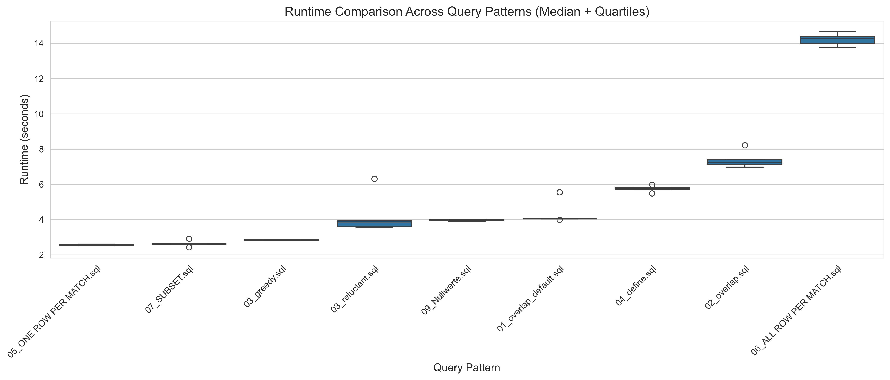
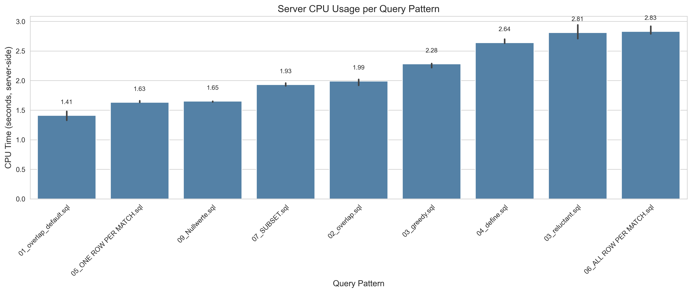
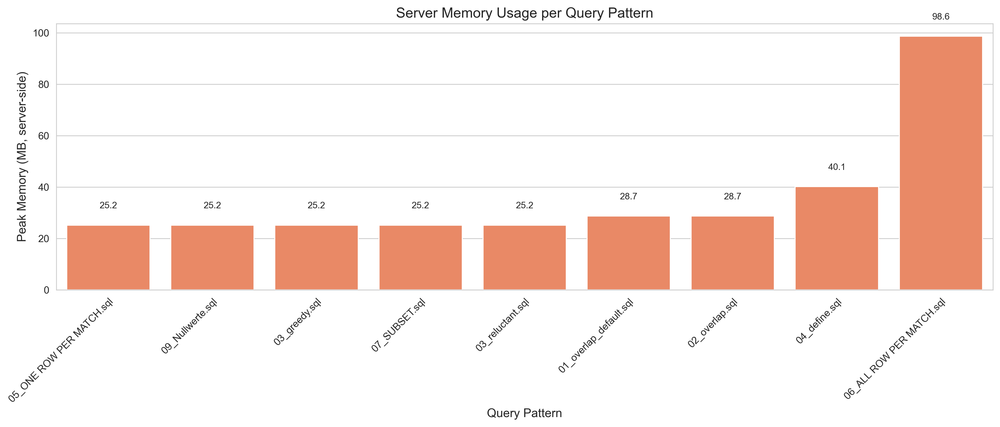
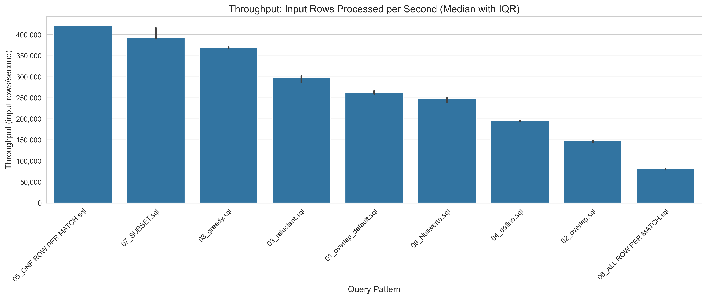

# Row Pattern Recognition: Benchmarking Suite

[](https://python.org)
[](https://trino.io)
[](#license)

> **Task 3** – RPRDPS Module, Humboldt-Universität zu Berlin

This project focuses on the analysis and benchmarking of `MATCH_RECOGNIZE` implementations in **Trino**.

<details>
<summary>🇩🇪 Deutsche Beschreibung</summary>

Dieses Projekt konzentriert sich auf die Analyse und das Benchmarking von `MATCH_RECOGNIZE`-Implementierungen in **Trino**, im Rahmen des Moduls RPRDPS an der Humboldt-Universität zu Berlin.
</details>

---

## Table of Contents

- [Project Structure](#-project-structure)
- [Prerequisites](#-prerequisites)
- [Installation](#-installation)
- [Data Generation (MR5)](#-data-generation-mr5)
- [Benchmarking Execution (MR6)](#-benchmarking-execution-mr6)
- [Metadata & Fairness (MR8)](#-metadata--fairness-mr8)
- [How to Reproduce (MR11)](#-how-to-reproduce-mr11)
- [Sample Results](#-sample-results)
- [License](#license)
- [Contact](#contact)

---

## Project Structure

```
trino/
├── Generator/              # Synthetic data generation scripts
│   └── Generator.py        # Main data generator (Berlin crime data)
├── queries/                # SQL files for MATCH_RECOGNIZE patterns
├── datasets/               # Generated CSV data files
├── results/
│   ├── mr6_results.csv     # Raw performance measurements
│   ├── mr6_metadata.json   # System configuration & environment
│   └── mr6_stats.json      # Statistical summaries (Median, Quartiles)
├── figures/                # Generated plots for analysis
├── benchmark.py            # Benchmark execution script
├── plot_results.py         # Visualization script
└── docker-compose.yml      # Docker configuration for Trino
```

---

## Prerequisites

| Requirement   | Version     | Notes                          |
|---------------|-------------|--------------------------------|
| Python        | 3.8+        | Core runtime                   |
| Trino         | 479         | Query engine                   |
| PostgreSQL    | 12+         | Storage layer (via connector)  |
| Docker        | 20+         | Container runtime (optional)   |

### Python Dependencies

```
pandas
numpy
trino
requests
matplotlib  # for plot_results.py
```

> [!TIP]
> Install all dependencies with:
> ```bash
> pip install pandas numpy trino requests matplotlib
> ```

---

## Installation

1. **Clone the repository:**
   ```bash
   git clone <repository-url>
   cd trino
   ```

2. **Start Trino (Docker):**
   ```bash
   docker-compose up -d
   ```

3. **Verify Trino is running:**
   ```bash
   curl http://localhost:8080/v1/info
   ```

---

## Data Generation (MR5)

The dataset is generated using a reproducible Python script with fixed seeds. We simulate Berlin crime data to test pattern matching performance.

### Command

```bash
python Generator/Generator.py --type large --scale 1 --partitions 12 --seed 42
```

### Options

| Flag             | Description                              | Default |
|------------------|------------------------------------------|---------|
| `--type`         | Dataset type: `tiny` or `large`          | —       |
| `--scale`        | Scale multiplier for row count           | `1`     |
| `--partitions`   | Number of partitions (districts)         | `12`    |
| `--seed`         | Random seed for reproducibility          | `42`    |
| `--complexity`   | Weight distribution (0=uniform, 1=realistic) | `0.3` |
| `--custom_weights` | Custom crime type weights (e.g., `"THEFT:0.5,ROBBERY:0.1"`) | — |

<details>
<summary>🇩🇪 Deutsche Beschreibung</summary>

Der Datensatz wird mit einem reproduzierbaren Python-Skript und fixierten Seeds generiert. Wir simulieren Berliner Kriminalitätsdaten, um die Performance des Pattern Matchings zu testen.

- **Selektivität:** Wir passen die Häufigkeit spezifischer Verbrechenstypen an, um die Filterstärke gemäß den Richtlinien zu testen.
- **Reproduzierbarkeit:** Ein fester Seed garantiert identische Datensätze in verschiedenen Testumgebungen.
</details>

---

## Benchmarking Execution (MR6)

The `benchmark.py` script automates query execution against the Trino engine.

### Execution Flow

1. **Warmup** – Each query runs once to prime system caches
2. **Iterations** – Each query repeats 5 times for statistical significance

### Metrics Collected

| Metric        | Description                                  |
|---------------|----------------------------------------------|
| Runtime       | Server-side execution time (Trino REST API)  |
| CPU Time      | Total CPU milliseconds consumed by cluster   |
| Peak Memory   | Highest memory reservation during query      |
| Throughput    | Input rows processed per second              |

### Run the Benchmark

```bash
python benchmark.py
```

> [!NOTE]
> Ensure Trino is running and the `crime_data` table is populated before running the benchmark.

<details>
<summary>🇩🇪 Deutsche Beschreibung</summary>

Das Skript `benchmark.py` automatisiert die Ausführung von Abfragen gegen die Trino-Engine.

- **Aufwärmen:** Jede Abfrage wird einmal ausgeführt, um die System-Caches aufzuwärmen.
- **Iterationen:** Jede Abfrage wird 5 Mal wiederholt, um statistische Signifikanz zu gewährleisten.
</details>

---

## Metadata & Fairness (MR8)

To ensure a fair comparison, the following artifacts are included:

### Architecture

```
┌─────────────────┐         ┌─────────────────┐
│  Trino Engine   │ ──────► │   PostgreSQL    │
│  (Compute)      │         │   (Storage)     │
└─────────────────┘         └─────────────────┘
```

- **Compute:** Trino performs all `MATCH_RECOGNIZE` operations in-memory
- **Storage:** PostgreSQL serves as the data connector

### Included Metadata

- `mr6_metadata.json` – Trino version (479), session properties, hardware environment
- **Isolation:** Benchmarks run in an isolated Docker environment

<details>
<summary>🇩🇪 Deutsche Beschreibung</summary>

Architektur (Compute vs. Storage): Trino fungiert als Compute-Engine, während PostgreSQL als Speicherschicht (Connector) genutzt wird. Obwohl die Daten in Postgres gespeichert sind, werden alle MATCH_RECOGNIZE-Operationen von Trino-Workern im Arbeitsspeicher ausgeführt.
</details>

---

## How to Reproduce (MR11)

Follow these steps to reproduce the benchmark:

```bash
# 1. Ensure Trino (v479) and PostgreSQL are running
docker-compose up -d

# 2. Generate the dataset
python Generator/Generator.py --type large --scale 1 --partitions 12 --seed 42

# 3. Load CSV into PostgreSQL table 'crime_data'
# (Use your preferred method: psql, pgAdmin, etc.)

# 4. Run the benchmark
python benchmark.py

# 5. Generate visualization plots
python plot_results.py
```

> [!IMPORTANT]
> Use the same seed value (default: 42) to ensure identical datasets across environments.

---

## Sample Results

Below are example visualizations generated by `plot_results.py`:

### Runtime Comparison



### CPU & Memory Usage





### Throughput Comparison



---

## License

This project is licensed under the MIT License. See [LICENSE](LICENSE) for details.

---

## Contact

**Team 3 – Benchmarking**  
RPRDPS Module  
Humboldt-Universität zu Berlin

---

<sub>Last updated: January 2026</sub>