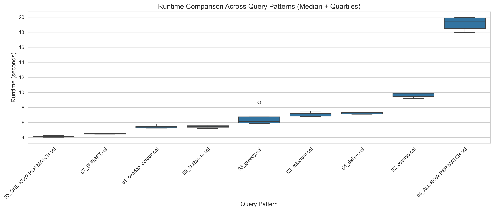
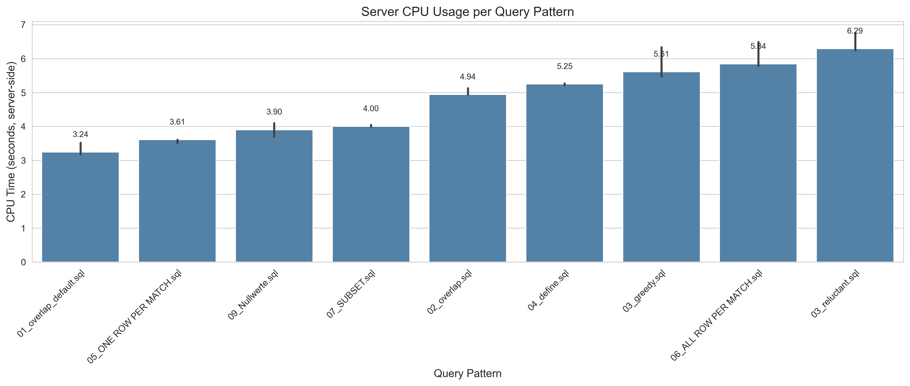
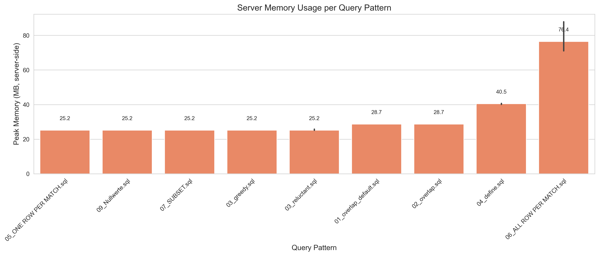
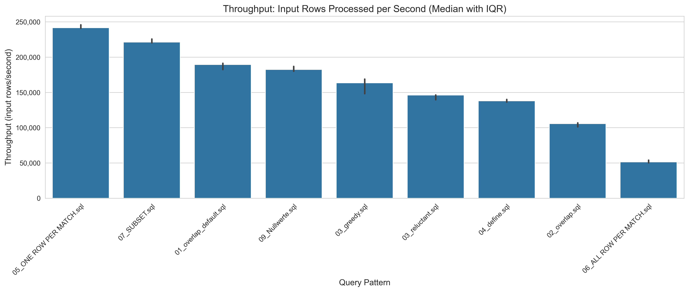

# Row Pattern Recognition: Benchmarking Suite

[](https://python.org)
[](https://trino.io)
[](#license)
[](https://codespaces.new/VetLyong/trino)
[](https://hub.docker.com/r/asterbons/rpr-benchmark)

> Performance evaluation and scalability study of SQL `MATCH_RECOGNIZE`. Conducted as a Semester Research Project at Humboldt-Universität zu Berlin.

This project focuses on the analysis and benchmarking of `MATCH_RECOGNIZE` implementations in **Trino**.

<details>
<summary>🇩🇪 Deutsche Beschreibung</summary>

Dieses Projekt konzentriert sich auf die Analyse und das Benchmarking von `MATCH_RECOGNIZE`-Implementierungen in **Trino**, im Rahmen des Moduls RPRDPS an der Humboldt-Universität zu Berlin.
</details>

---

## Table of Contents

- [Project Structure](#-project-structure)
- [Prerequisites](#-prerequisites)
- [Installation](#-installation)
- [Data Generation](#-data-generation)
- [Benchmarking Execution](#-benchmarking-execution)
- [Metadata & Fairness](#-metadata--fairness)
- [How to Reproduce](#-how-to-reproduce)
- [Sample Results](#-sample-results)
- [License](#license)
- [Contact](#contact)

---

## Project Structure

```
trino/
├── Generator/              # Synthetic data generation scripts
│   ├── Generator.py        # Main data generator (Berlin crime data)
│   └── generate_all_scales.py  # Generates all scalability dataset sizes
├── queries/                # SQL files for MATCH_RECOGNIZE patterns
├── datasets/               # Generated CSV data files
├── output/
│   ├── results.csv         # Raw performance measurements
│   ├── metadata.json       # System configuration & environment
│   └── stats.json          # Statistical summaries (Median, Quartiles)
├── figures/                # Generated plots for analysis
├── benchmark.py            # Benchmark execution script
├── plot_results.py         # Visualization script (standard benchmark)
├── plot_scalability.py     # Visualization script (scalability results)
├── run_scalability.py      # Scalability benchmark runner
├── docker-compose.yml      # Docker configuration for Trino
└── docker-compose.scalability.yml  # Docker config with extra memory for scalability tests
```

---

## Prerequisites

| Requirement   | Version     | Notes                          |
|---------------|-------------|--------------------------------|
| Python        | 3.8+        | Core runtime                   |
| Trino         | 434         | Query engine                   |
| PostgreSQL    | 12+         | Storage layer (via connector)  |
| Docker        | 20+         | Container runtime              |

---

## Installation

### Option A — GitHub Codespaces (recommended, zero setup)

Click the **Open in GitHub Codespaces** badge above. Docker and Python are pre-installed; the venv is created automatically. Then just run:

```bash
bash run_all.sh
```

> [!WARNING]
> **Codespace memory limitation:** The default Codespace (16 GB RAM) is not sufficient for the full scalability benchmark (Phase 3). Trino requires up to 12 GB JVM heap and runs alongside PostgreSQL, leaving little headroom for memory-intensive query patterns. Specifically:
> - **Greedy quantifier queries** (`MATCH_RECOGNIZE` with `+` or `*`) require O(n²) intermediate state and crash Trino at dataset sizes ≥ 10K rows, causing all subsequent queries in that run to fail as well.
> - **10M-row datasets** exhaust available memory even for simple patterns, producing no results at all.
> - Sizes 1K and smaller complete successfully for all query patterns.
>
> For full scalability results, run on a machine with at least 32 GB RAM.

### Option B — Local

1. **Clone the repository:**
   ```bash
   git clone <repository-url>
   cd trino
   ```

2. **Install [Docker Desktop](https://www.docker.com/products/docker-desktop/) and make sure it is running.**

> [!TIP]
> Python dependencies are managed automatically by `run_all.sh` inside a `.venv` virtualenv. No manual `pip install` needed.

---

## Data Generation

The dataset is generated using a reproducible Python script with fixed seeds. We simulate Berlin crime data to test pattern matching performance.

### Command

```bash
python Generator/Generator.py --type large --scale 1 --partitions 12 --seed 42
```

### Options

| Flag             | Description                              | Default |
|------------------|------------------------------------------|---------|
| `--type`         | Dataset type: `tiny` or `large`          | —       |
| `--scale`        | Scale multiplier for row count           | `1`     |
| `--partitions`   | Number of partitions (districts)         | `12`    |
| `--seed`         | Random seed for reproducibility          | `42`    |
| `--complexity`   | Weight distribution (0=uniform, 1=realistic) | `0.3` |
| `--custom_weights` | Custom crime type weights (e.g., `"THEFT:0.5,ROBBERY:0.1"`) | — |

<details>
<summary>🇩🇪 Deutsche Beschreibung</summary>

Der Datensatz wird mit einem reproduzierbaren Python-Skript und fixierten Seeds generiert. Wir simulieren Berliner Kriminalitätsdaten, um die Performance des Pattern Matchings zu testen.

- **Selektivität:** Wir passen die Häufigkeit spezifischer Verbrechenstypen an, um die Filterstärke gemäß den Richtlinien zu testen.
- **Reproduzierbarkeit:** Ein fester Seed garantiert identische Datensätze in verschiedenen Testumgebungen.
</details>

---

## Methodology

The benchmark is designed as a controlled experiment to isolate `MATCH_RECOGNIZE` performance characteristics:

| Decision | Rationale |
|---|---|
| **Scale factors 1K – 10M rows** | Covers three orders of magnitude to reveal linear vs. super-linear scaling behavior and memory pressure thresholds. |
| **Seed 42** | A single fixed seed ensures bitwise-identical datasets across environments, making results reproducible without shipping large CSV files. |
| **1 warmup + 5 measurement iterations** | The warmup primes JVM JIT compilation and OS page caches. Five iterations provide enough samples to compute a stable median and inter-quartile range while keeping total runtime practical. |
| **12 partitions (Berlin districts)** | Maps naturally to the 12 real Berlin districts, giving each partition a distinct coordinate cluster and crime-type distribution for realistic spatial queries. |
| **Isolated Docker environment** | Eliminates host-level interference (other processes, caching differences) and guarantees a reproducible Trino + PostgreSQL stack. |

## Benchmarking Execution

The `benchmark.py` script automates query execution against the Trino engine.

### Execution Flow

1. **Warmup** – Each query runs once to prime system caches
2. **Iterations** – Each query repeats 5 times for statistical significance

### Metrics Collected

| Metric        | Description                                  |
|---------------|----------------------------------------------|
| Runtime       | Server-side execution time (Trino REST API)  |
| CPU Time      | Total CPU milliseconds consumed by cluster   |
| Peak Memory   | Highest memory reservation during query      |
| Throughput    | Input rows processed per second              |

### Run the Benchmark

```bash
python benchmark.py
```

> [!NOTE]
> Ensure Trino is running and the `crime_data` table is populated before running the benchmark.

<details>
<summary>🇩🇪 Deutsche Beschreibung</summary>

Das Skript `benchmark.py` automatisiert die Ausführung von Abfragen gegen die Trino-Engine.

- **Aufwärmen:** Jede Abfrage wird einmal ausgeführt, um die System-Caches aufzuwärmen.
- **Iterationen:** Jede Abfrage wird 5 Mal wiederholt, um statistische Signifikanz zu gewährleisten.
</details>

---

## Scalability Benchmarking

To evaluate how `MATCH_RECOGNIZE` scales with data volume, a separate scalability benchmark is included.

### Generate all dataset sizes (1K – 10M rows)

```bash
python Generator/generate_all_scales.py
```

### Run the scalability benchmark

```bash
# Start Trino with extra memory
docker compose -f docker-compose.scalability.yml up -d

# Run scalability benchmark
python run_scalability.py

# Generate scalability plots
python plot_scalability.py
```

---

## Metadata & Fairness

To ensure a fair comparison, the following artifacts are included:

### Architecture

```
┌─────────────────┐         ┌─────────────────┐
│  Trino Engine   │ ──────► │   PostgreSQL    │
│  (Compute)      │         │   (Storage)     │
└─────────────────┘         └─────────────────┘
```

- **Compute:** Trino performs all `MATCH_RECOGNIZE` operations in-memory
- **Storage:** PostgreSQL serves as the data connector

### Included Metadata

- `metadata.json` – Trino version (434), session properties, hardware environment
- **Isolation:** Benchmarks run in an isolated Docker environment

<details>
<summary>🇩🇪 Deutsche Beschreibung</summary>

Architektur (Compute vs. Storage): Trino fungiert als Compute-Engine, während PostgreSQL als Speicherschicht (Connector) genutzt wird. Obwohl die Daten in Postgres gespeichert sind, werden alle MATCH_RECOGNIZE-Operationen von Trino-Workern im Arbeitsspeicher ausgeführt.
</details>

---

## How to Reproduce

### One-click (recommended)

```bash
bash run_all.sh
```

This single command will:
1. Check that Docker is installed and running
2. Create a `.venv` virtualenv and install all Python dependencies
3. Generate the standard 1M-row dataset (seed=42) and all scalability datasets (1K–10M)
4. Run the standard benchmark and produce plots in `figures/`
5. Run the scalability benchmark and produce plots in `output/scalability/`

```bash
# Skip data generation if datasets already exist
bash run_all.sh --skip-gen
```

### Manual step-by-step

```bash
# 1. Create and activate virtualenv
python3 -m venv .venv
source .venv/bin/activate          # Windows Git Bash / Linux / macOS
# .venv\Scripts\activate           # Windows CMD / PowerShell

# 2. Install dependencies
pip install -r requirements.txt

# 3. Generate the dataset
python Generator/Generator.py --type large --scale 1 --partitions 12 --seed 42

# 4. Start Docker stack (CSV is loaded automatically on container startup)
docker compose up -d

# 5. Run the benchmark
python benchmark.py

# 6. Generate visualization plots
python plot_results.py
```

> [!IMPORTANT]
> Use the same seed value (default: 42) to ensure identical datasets across environments.

---

## Sample Results

Below are example visualizations generated by `plot_results.py`:

### Runtime Comparison



### CPU & Memory Usage





### Throughput Comparison



### Scalability Performance


---

## License

This project is licensed under the MIT License. See [LICENSE](LICENSE) for details.

---

## Contact

**Vet Lyong**  
Semester Research Project – Humboldt-Universität zu Berlin  
[GitHub](https://github.com/Asterbons) 

---

<sub>Last updated: March 2026</sub>